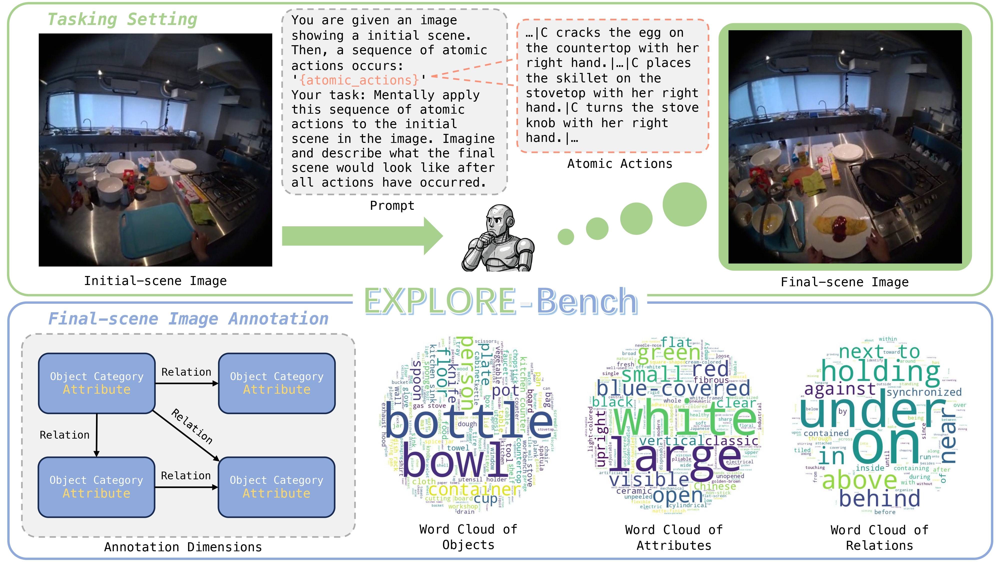

# EXPLORE-Bench: Egocentric Scene Prediction with Long-Horizon Reasoning

<div align=center>

[](https://arxiv.org/abs/2603.09731) 
[](https://huggingface.co/datasets/pengfei2025/EXPLORE-Dataset)
[](https://jackyu6.github.io/EXPLORE-Page/)

</div>

## 🔍 Overview
<p align="center">
    
<p>

<strong>EXPLORE-Bench</strong> evaluates MLLMs on a new task: egocentric scene prediction with long-horizon reasoning. We annotate the final scene at the object, attribute, and relation levels to enable fine-grained scene-level evaluation. Note that the prompt is abbreviated for brevity in this figure.

## 🌟 Run Your Own Evaluation
### 🛠️ Installation
Set up your environment:

```shell
conda create --name explore python=3.10 -y
conda activate explore

git clone git@github.com:JackYu6/EXPLORE-Bench.git
cd EXPLORE-Bench

pip install -r requirements.txt
pip install flash-attn --no-build-isolation
python -m spacy download en_core_web_lg
```

### 📚 parser and LLM evaluator
Download the weights of [Sentence-Transformers](https://huggingface.co/sentence-transformers/all-MiniLM-L6-v2) and [Qwen3](https://huggingface.co/Qwen/Qwen3-8B) from huggingface.

### 🤗 Dataset
Our dataset is hosted on [HuggingFace](https://huggingface.co/datasets/pengfei2025/EXPLORE-Dataset). 

### ⚙️ Inference
Our codebase supports a variety of models for inference. Adjust the settings in `infer/infer.sh`, then run the script to begin your inference.

To run your own models, you can add a class in the `infer/models` directory.

Please refer to our [inference documentation](infer/infer.md) for detailed guidance.

### 📈 Evaluation
We divide inference and evaluation into two separate steps so that the inference outputs can be evaluated on each subset. Adjust the settings in `eval/eval.sh`, then run the script to begin your evaluation.

Please refer to our [evaluation documentation](eval/eval.md) for detailed guidance.

## 📑 Citation
If you find our work helpful, please consider starring our repository and citing:
```
@article{yu2026explore,
  title={EXPLORE-Bench: Egocentric Scene Prediction with Long-Horizon Reasoning},
  author={Yu, Chengjun and Zhu, XuHan and Du, Chaoqun and Yu, Pengfei and Zhai, Wei and Cao, Yang and Zha, Zheng-Jun},
  journal={arXiv preprint arXiv:2603.09731},
  year={2026}
}
```

## ✨️ Acknowledgement
We sincerely thank the open-sourcing of these works where our code is based on:

[CompreCap](https://github.com/LuFan31/CompreCap) and [EOC-Bench](https://github.com/alibaba-damo-academy/EOCBench).